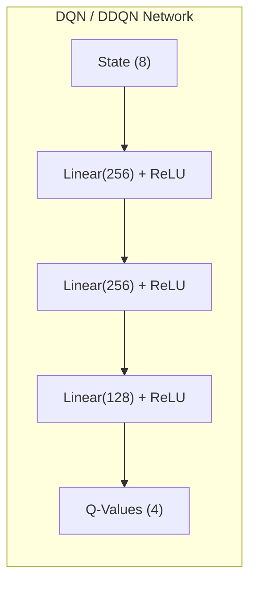
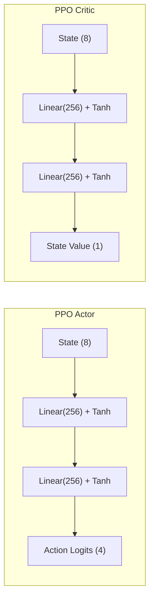
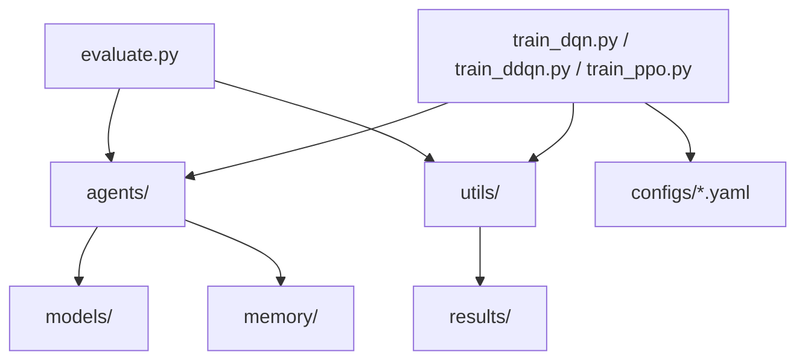
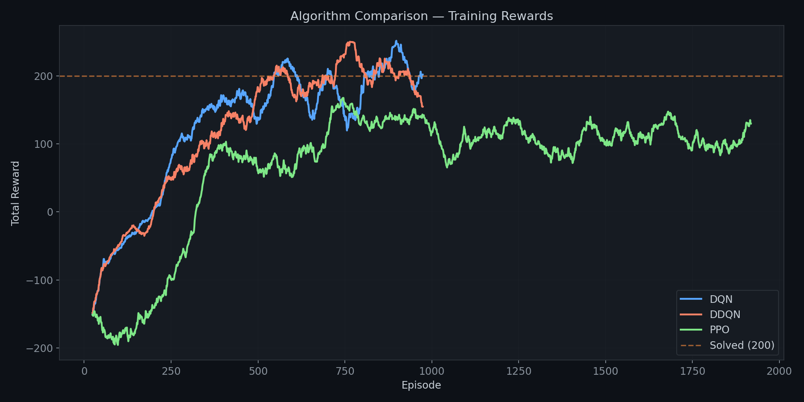
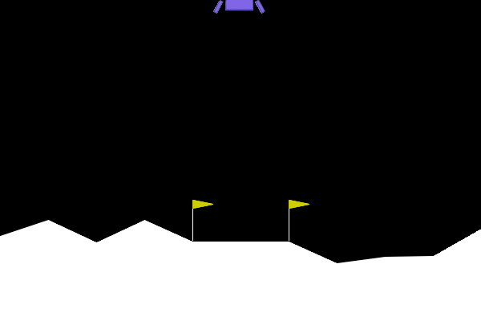
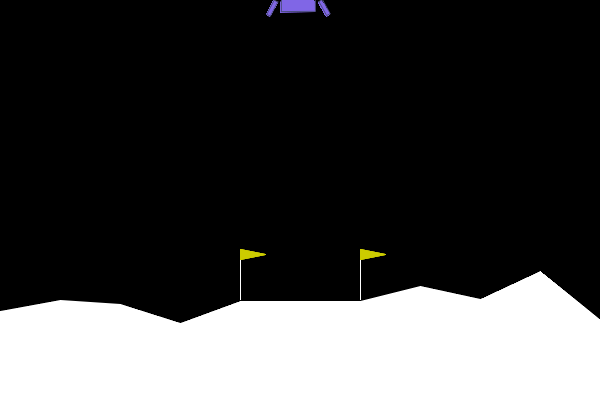
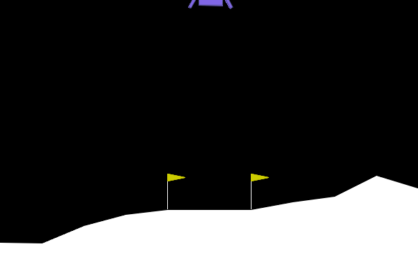

# 🚀 Autonomous Lunar Lander: Comparative Reinforcement Learning Framework

<div align="center">


**A production-quality benchmarking framework comparing DQN, Double DQN, and PPO
on the LunarLander-v3 environment.**

[Getting Started](#-installation) · [Results](#-results) · [Architecture](#-architecture) · [Usage](#-usage)

</div>

---

## 📖 Project Overview

This repository provides a **modular, reproducible** framework for training and evaluating three reinforcement learning algorithms on OpenAI Gymnasium's [LunarLander-v3](https://gymnasium.farama.org/environments/box2d/lunar_lander/) environment:

| Algorithm | Type | Implementation |
|-----------|------|----------------|
| **DQN** | Value-based | Custom PyTorch |
| **Double DQN** | Value-based | Custom PyTorch |
| **PPO** | Policy-gradient | Stable-Baselines3 |

### Key Features

- 🎯 **Complete training pipelines** with TensorBoard logging
- 📊 **Automated visualizations** — reward curves, loss curves, comparison plots
- 🎬 **GIF generation** of trained agents landing
- 📈 **Comprehensive evaluation** — success rate, crash rate, landing accuracy
- ⚙️ **YAML-based configuration** for easy hyperparameter tuning
- 🔬 **Full reproducibility** via global seed management
- 💾 **Automatic checkpointing** with best-model tracking

---

## 🧠 Reinforcement Learning Concepts

### The Environment

The Lunar Lander must navigate from the top of the screen to the landing pad at coordinates (0, 0). The agent receives an **8-dimensional state** (position, velocity, angle, leg contact) and chooses from **4 discrete actions** (no-op, left engine, main engine, right engine).

**Reward structure:**
- Moving toward the pad: **+100 to +140**
- Crashing: **−100**
- Each leg contact: **+10**
- Firing main engine: **−0.3** per frame
- Solved threshold: **200+ average over 100 consecutive episodes**

---

### Deep Q-Network (DQN)

DQN approximates the optimal action-value function Q*(s, a) using a neural network, trained with:

1. **Experience Replay** — breaks temporal correlation by sampling uniformly from a replay buffer
2. **Target Network** — stabilises training by using a slowly-updated copy for computing TD targets
3. **ε-Greedy Exploration** — balances exploration vs. exploitation with decaying ε

**Bellman target (DQN):**

```
Q_target = r + γ · max_a' Q_target_net(s', a')
```

### Double DQN

Standard DQN overestimates Q-values because the same network both **selects** and **evaluates** actions. Double DQN decouples these:

```
a* = argmax_a' Q_online(s', a')          ← action SELECTION (online net)
Q_target = r + γ · Q_target_net(s', a*)  ← action EVALUATION (target net)
```

This simple change significantly reduces overestimation bias and often leads to faster, more stable convergence.

### Proximal Policy Optimization (PPO)

PPO is an actor-critic algorithm that directly optimises the policy using a **clipped surrogate objective**:

```
L_CLIP = E[ min(r_t(θ) · A_t,  clip(r_t(θ), 1-ε, 1+ε) · A_t) ]
```

where `r_t(θ)` is the probability ratio between new and old policies and `A_t` is the advantage estimate (computed via GAE).

**Advantages over DQN:**
- Works with both continuous and discrete action spaces
- More stable training through constrained policy updates
- No replay buffer needed (on-policy)

---

## 🏗️ Architecture

### Network Architectures





### Project Structure



### Repository Layout

```
Lunar-Lander-RL/
│
├── README.md                    # This file
├── requirements.txt             # Python dependencies
├── train_dqn.py                 # DQN training entry point
├── train_ddqn.py                # Double DQN training entry point
├── train_ppo.py                 # PPO training entry point
├── evaluate.py                  # Unified evaluation + GIF generation
│
├── configs/                     # Hyperparameter configs (YAML)
│   ├── dqn.yaml
│   ├── ddqn.yaml
│   └── ppo.yaml
│
├── agents/                      # Agent implementations
│   ├── dqn_agent.py             # DQN with ε-greedy, replay, target net
│   ├── ddqn_agent.py            # Double DQN (decoupled selection/evaluation)
│   └── ppo_agent.py             # SB3 PPO wrapper
│
├── models/                      # Neural network architectures
│   ├── dqn_network.py           # 8→256→256→128→4 (ReLU)
│   ├── dueling_network.py       # Dueling DQN (Value + Advantage streams)
│   ├── actor.py                 # PPO policy head (Tanh)
│   └── critic.py                # PPO value head (Tanh)
│
├── memory/                      # Experience storage
│   ├── replay_buffer.py         # Uniform replay buffer
│   └── prioritized_replay.py   # Proportional PER
│
├── utils/                       # Shared utilities
│   ├── plotting.py              # Reward/loss/comparison charts
│   ├── recorder.py              # GIF / MP4 recording
│   ├── metrics.py               # Evaluation statistics
│   ├── logger.py                # Structured logging
│   └── seed.py                  # Reproducibility (seeds + device)
│
├── checkpoints/                 # Saved model weights
├── tensorboard_logs/            # TensorBoard event files
├── results/                     # Plots, GIFs, JSON reports
└── docs/                        # Additional documentation
```

---

## 🛠️ Installation

### Prerequisites

- Python 3.11+
- pip

### Setup

```bash
# Clone the repository
git clone https://github.com/yourusername/Lunar-Lander-RL.git
cd Lunar-Lander-RL

# Create a virtual environment (recommended)
python -m venv venv
source venv/bin/activate        # Linux / macOS
venv\Scripts\activate           # Windows

# Install dependencies
pip install -r requirements.txt
```

> **Note:** The `gymnasium[box2d]` package requires [SWIG](https://www.swig.org/) to be installed. On Windows, install it via `conda install swig` or download from the SWIG website.

---

## 🚀 Usage

### Training

```bash
# Train DQN (≈ 1000 episodes, ~20 min on CPU)
python train_dqn.py

# Train Double DQN
python train_ddqn.py

# Train PPO (1M timesteps, ~15 min on CPU)
python train_ppo.py

# Custom configuration
python train_dqn.py --config configs/dqn.yaml --episodes 500 --seed 123
python train_ppo.py --timesteps 2000000
```

### Evaluation

```bash
# Evaluate a single agent (100 episodes + GIF)
python evaluate.py --agent dqn --model checkpoints/dqn_best.pth
python evaluate.py --agent ppo --model checkpoints/ppo_best

# Evaluate ALL agents + generate comparison plot
python evaluate.py --agent all --episodes 100

# Skip GIF recording (faster)
python evaluate.py --agent ddqn --no-gif
```

### TensorBoard

```bash
tensorboard --logdir tensorboard_logs/
```

Visit `http://localhost:6006` to view live training curves.

---

## 📊 Results

### Hyperparameters

| Parameter | DQN | Double DQN | PPO |
|-----------|-----|------------|-----|
| Learning Rate | 5×10⁻⁴ | 5×10⁻⁴ | 3×10⁻⁴ |
| Discount (γ) | 0.99 | 0.99 | 0.99 |
| Batch Size | 128 | 128 | 64 |
| Buffer Size | 100,000 | 100,000 | — (on-policy) |
| Target Update | 5 episodes | 5 episodes | — |
| ε Start → Min | 1.0 → 0.01 | 1.0 → 0.01 | — |
| Clip Range | — | — | 0.2 |
| GAE λ | — | — | 0.95 |
| Training | 1,000 episodes | 1,000 episodes | 1M timesteps |

### Evaluation Metrics (100 episodes)

After training, each agent is evaluated over 100 episodes:

| Metric | DQN | Double DQN | PPO |
|--------|-----|------------|-----|
| **Average Reward** | 221.77 | **265.00** | 124.27 |
| **Median Reward** | 268.84 | **281.33** | 184.10 |
| **Success Rate** | 86.0% | **97.0%** | 70.0% |
| **Crash Rate** | 4.0% | **0.0%** | 15.0% |
| **Landing Accuracy**| 95.35% | **100.0%** | 48.57% |

*Note: Double DQN achieved the highest stability and landing accuracy, successfully mitigating the overestimation bias of standard DQN.*

### Visual Outputs

#### Training Reward Comparison


#### Best Landings (Evaluation)
| DQN | Double DQN | PPO |
|:---:|:----------:|:---:|
|  |  |  |

---

## 🔮 Future Improvements

- [ ] **Dueling DQN** — already implemented in `models/dueling_network.py`, integrate as a training option
- [ ] **Prioritized Experience Replay** — implemented in `memory/prioritized_replay.py`, add as a config flag
- [ ] **Noisy Networks** — replace ε-greedy with parametric noise for more efficient exploration
- [ ] **Rainbow DQN** — combine DQN improvements (Dueling + PER + Noisy + N-step + Distributional)
- [ ] **SAC / TD3** — extend to continuous-action version of Lunar Lander
- [ ] **Hyperparameter Sweeps** — integrate Optuna for automated tuning
- [ ] **Multi-environment Benchmarking** — test on CartPole, Acrobot, BipedalWalker
- [ ] **Docker Support** — containerized training for reproducibility
- [ ] **Weights & Biases Integration** — advanced experiment tracking

---

## 📜 License

This project is licensed under the MIT License. See [LICENSE](LICENSE) for details.

---

## 🙏 Acknowledgements

- [Gymnasium](https://gymnasium.farama.org/) — RL environment suite
- [Stable-Baselines3](https://stable-baselines3.readthedocs.io/) — PPO implementation
- [PyTorch](https://pytorch.org/) — deep learning framework
- Mnih et al., *"Human-level control through deep reinforcement learning"*, Nature 2015
- Van Hasselt et al., *"Deep Reinforcement Learning with Double Q-learning"*, AAAI 2016
- Schulman et al., *"Proximal Policy Optimization Algorithms"*, arXiv 2017
